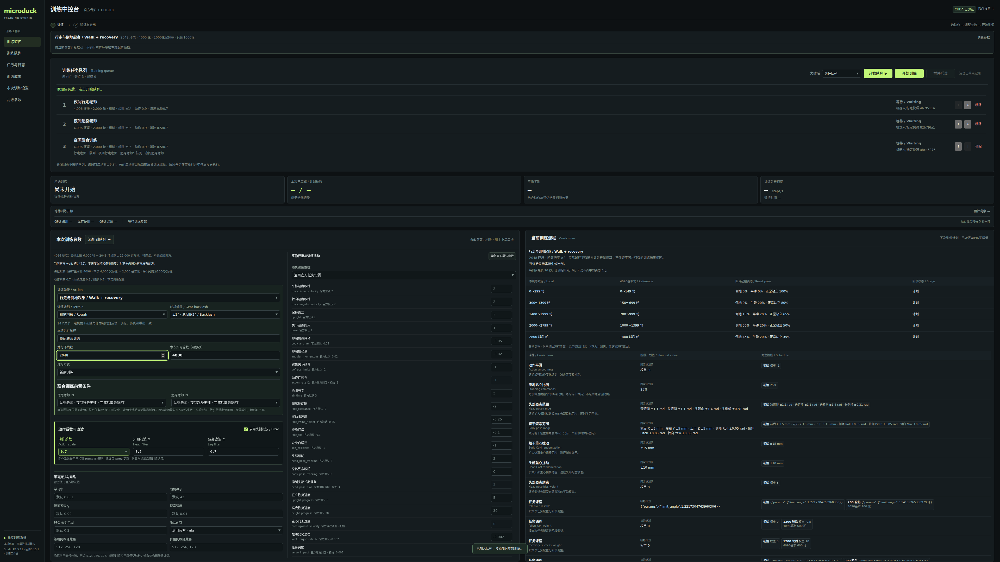

# R1.5.11 按钮位置调整

- “添加到队列”放在“本次训练参数”标题旁，填写参数后就近添加。
- “开始训练”放在训练队列操作栏，与“开始队列”并排；停止当前训练、取消启动也在这栏。
- “开始训练”提交当前页面的一项训练；“开始队列”按列表顺序运行队列，两者保留原有行为。

浏览器验证通过：添加三个任务、队列依次执行、暂停/继续、失败重试、清理记录，以及移动后的“开始训练”真实提交表单。4K、1920、1280、1024、390宽度没有页面横向溢出，没有脚本错误或自动环境检查。测试使用真实HTTP和中控调度，训练进程由测试夹具模拟，没有操作用户WSL或GPU训练。

默认并行数仍为4096。训练执行器、动作系数、滤波、课程、标定与官方冻结源码不作调整。

从R1.5.10只更新本次界面时，将本包 `training/static` 覆盖到原包同名文件夹，然后Ctrl+F5刷新即可。正在运行的后台及训练无需关闭。

